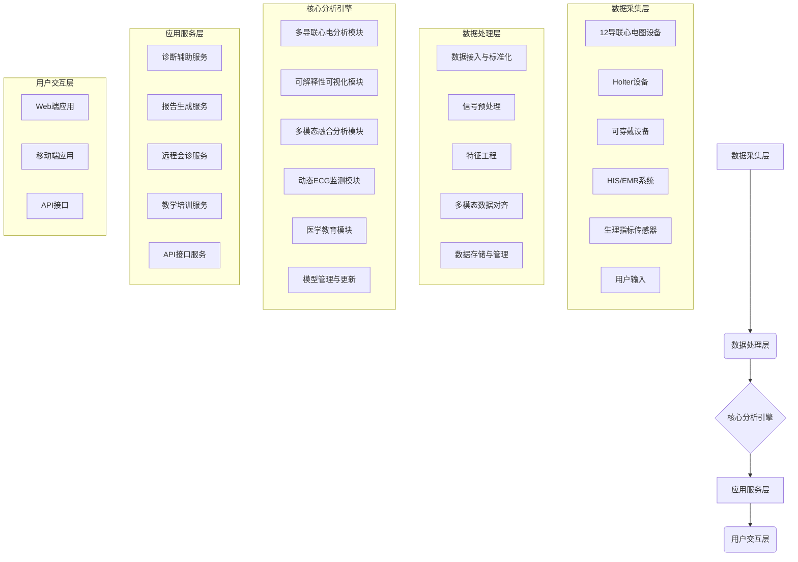
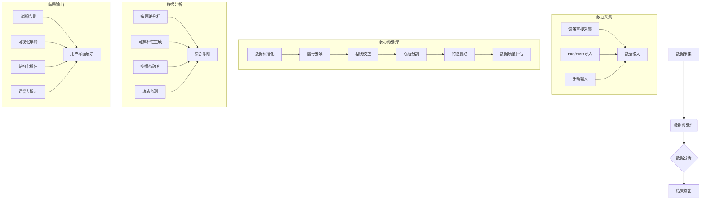
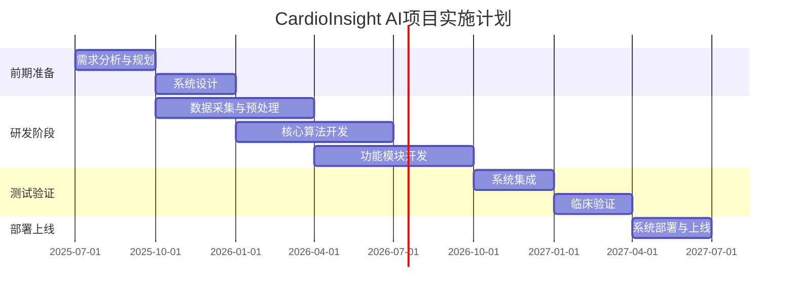

# CardioInsight AI: 多模态智能心电分析与辅助诊疗系统

**项目概要书**

**作者：Manus AI**

**日期：2025年6月5日**

## 目录

1. [项目背景与意义](#1-项目背景与意义)
2. [项目目标与愿景](#2-项目目标与愿景)
3. [系统创新点与技术优势](#3-系统创新点与技术优势)
4. [系统架构与功能模块](#4-系统架构与功能模块)
5. [技术实现方案](#5-技术实现方案)
6. [应用场景与用户分析](#6-应用场景与用户分析)
7. [项目实施计划](#7-项目实施计划)
8. [预期效果与评估指标](#8-预期效果与评估指标)
9. [竞争优势分析](#9-竞争优势分析)
10. [团队与资源](#10-团队与资源)
11. [结论与展望](#11-结论与展望)
12. [参考文献](#12-参考文献)

## 1. 项目背景与意义

### 1.1 心血管疾病的全球负担与挑战

心血管疾病（Cardiovascular Disease, CVD）是全球范围内的主要死亡原因，每年导致约1790万人死亡，占全球死亡总数的32%[1]。在中国，心血管疾病同样是首要健康威胁，据《中国心血管健康与疾病报告2022》显示，我国心血管疾病患病人数已达3.3亿，且呈现出年轻化、城乡差异大的特点[2]。随着人口老龄化进程加速，心血管疾病的防治形势愈发严峻。

心电图（Electrocardiogram, ECG）作为心血管疾病诊断的基础工具，具有无创、便捷、经济等优势，在临床实践中被广泛应用。然而，传统心电图诊断面临多重挑战：

1. **专业人才短缺**：心电图判读需要专业知识和丰富经验，而心电图医师尤其是高水平专家相对稀缺，无法满足日益增长的诊断需求。
2. **诊断效率低下**：传统心电图判读依赖人工，耗时费力，难以应对大量心电数据的快速处理需求。
3. **诊断质量参差不齐**：不同医生的判读水平存在差异，导致诊断结果的一致性和准确性受到影响。
4. **医疗资源分布不均**：优质医疗资源集中在大城市和三甲医院，基层医疗机构和偏远地区的心电诊断能力有限。
5. **长时程监测困难**：传统心电图难以实现长时间连续监测，对于间歇性心律失常等疾病的诊断存在局限性。

人工智能（Artificial Intelligence, AI）技术的快速发展为解决上述挑战提供了新的可能。AI在心电图分析领域的应用已取得显著进展，能够自动识别多种心律失常、预测心血管事件风险、辅助临床决策等。然而，现有的AI心电系统仍存在诸多局限性，亟需创新突破。

### 1.2 现有AI心电系统的局限性分析

当前市场上的AI心电系统主要分为三类：商业系统、可穿戴设备和公共模型。每类系统都存在各自的局限性，制约了AI技术在心电诊断领域的深入应用。

**表1-1 现有AI心电系统的局限性**

| 系统类型 | 代表产品 | 主要局限性 |
|---------|---------|----------|
| 商业系统 | 华为云AI心电图分析、腾讯觅影 | 黑箱算法、不开放源代码、可解释性差、对边缘案例处理不充分 |
| 可穿戴设备 | Apple Watch、Fitbit | 仅支持单导联ECG、功能有限、误报率较高、临床应用受限 |
| 公共模型 | 基于MIT-BIH数据集的模型 | 训练数据样本偏少、泛化能力不足、更新慢、难以应对复杂临床场景 |

#### 1.2.1 商业系统的局限性

目前市场上的商业AI心电系统（如华为云、腾讯觅影等）虽然在特定场景下表现出较高的准确性，但普遍存在以下问题：

1. **黑箱算法**：大多数商业系统采用封闭的黑箱算法，医生无法了解系统做出特定诊断的依据，降低了临床可信度。
2. **可解释性不足**：缺乏对异常心电波形的可视化解释，医生难以验证AI判断的合理性。
3. **边缘案例处理不充分**：对于罕见病例或非典型表现，系统表现欠佳，可能导致误诊或漏诊。
4. **单一模态输入**：多数系统仅依赖心电图数据，未能整合患者病史、症状等多模态信息，与临床实际诊断流程存在差距。
5. **部署成本高**：商业系统通常需要高性能硬件支持，部署和维护成本较高，不适合基层医疗机构。

#### 1.2.2 可穿戴设备的局限性

以Apple Watch为代表的可穿戴设备虽然实现了心电监测的便携化和常态化，但在临床应用中仍面临诸多挑战：

1. **单导联限制**：多数可穿戴设备仅支持单导联ECG，无法提供多导联心电图所能捕捉的全面心脏电活动信息。
2. **功能有限**：主要集中于房颤检测等有限几种心律失常，对复杂心电异常的识别能力不足。
3. **误报率高**：由于信号质量不稳定和算法局限，常出现假阳性结果，增加医疗资源浪费和患者焦虑。
4. **临床整合不足**：与医院现有系统的整合度低，难以实现数据的无缝流转和临床决策支持。
5. **长时程数据分析能力弱**：对24小时以上的长时程心电数据缺乏有效的分析和管理能力。

#### 1.2.3 公共模型的局限性

基于开源数据集（如MIT-BIH）开发的公共AI模型在研究领域有一定应用，但距离临床实用仍有差距：

1. **训练数据局限**：多基于小样本、单一人群的历史数据集训练，样本代表性不足，难以适应多样化的临床场景。
2. **泛化能力不足**：在不同设备、不同人群、不同临床环境下的表现一致性差。
3. **更新迭代慢**：难以及时整合最新的临床发现和技术进步，模型迭代周期长。
4. **临床验证不足**：缺乏大规模、多中心的临床验证，实际应用效果存疑。
5. **缺乏标准化**：不同模型间缺乏统一的评估标准和接口规范，难以比较和集成。

### 1.3 项目的创新意义与社会价值

面对现有AI心电系统的局限性和临床实际需求，本项目提出CardioInsight AI多模态智能心电分析与辅助诊疗系统，旨在通过技术创新和临床实践的深度融合，构建更智能、更可信、更贴近临床需求的新一代AI心电分析平台。

#### 1.3.1 创新意义

本项目在以下方面具有显著的创新意义：

1. **技术创新**：通过多导联分析、可解释性技术、多模态融合、动态ECG自动标注等技术创新，突破现有AI心电系统的技术瓶颈，提升诊断准确性和可靠性。
2. **模式创新**：将AI技术与医学教育、远程医疗深度融合，创新医疗服务模式，提高医疗资源利用效率。
3. **应用创新**：针对基层医疗和偏远地区的特殊需求，开发轻量化、低成本的解决方案，促进优质医疗资源下沉。
4. **学科交叉创新**：整合人工智能、医学、教育学等多学科知识，推动跨领域协同创新。

#### 1.3.2 社会价值

本项目的实施将产生广泛的社会价值：

1. **提升诊疗质量**：通过AI辅助诊断，提高心电图诊断的准确性和一致性，减少误诊漏诊，改善患者预后。
2. **提高医疗效率**：自动化心电分析可大幅提高诊断效率，缓解医疗资源紧张状况，使医生能够专注于更复杂的临床决策。
3. **促进医疗公平**：为基层医疗机构和偏远地区提供高质量的心电诊断支持，缩小区域间医疗服务差距，促进医疗资源均衡分布。
4. **培养医学人才**：通过AI辅助教学系统，提高医学生和基层医生的心电图诊断能力，加速医学人才培养。
5. **降低医疗成本**：早期识别心血管疾病风险，减少严重并发症和住院治疗，降低整体医疗支出。
6. **推动产业发展**：促进医疗AI技术创新和产业化，带动相关产业链发展，创造经济和社会效益。

综上所述，CardioInsight AI项目不仅具有重要的技术创新意义，更能产生显著的社会价值，对推动我国心血管疾病防治和医疗AI技术发展具有重要意义。

---

**参考文献**

[1] World Health Organization. Cardiovascular diseases (CVDs). https://www.who.int/news-room/fact-sheets/detail/cardiovascular-diseases-(cvds)

[2] 中国心血管健康与疾病报告编写组. 中国心血管健康与疾病报告2022概要. 中国循环杂志, 2023, 38(3): 211-220.

## 2. 项目目标与愿景

### 2.1 总体目标

CardioInsight AI项目旨在开发一个多模态智能心电分析与辅助诊疗系统，通过整合多导联心电分析、可解释性技术、多模态数据融合、动态ECG自动标注、医学教育和远程医疗功能，构建一个全面、智能、可信的心电辅助诊疗平台，提升心血管疾病诊断的准确性、效率和可及性，为医疗机构、医学教育和患者提供全方位的智能支持。

### 2.2 具体目标

#### 2.2.1 技术目标

1. **高精度多导联分析**：开发支持12导联心电图分析的AI模型，诊断准确率达到95%以上，覆盖常见心律失常、心肌缺血、电解质紊乱等多种心电异常。

2. **可解释性可视化**：实现基于Grad-CAM等技术的心电异常区域可视化，为每个诊断提供置信度评估和可视化解释，提高AI诊断的透明度和可信度。

3. **多模态数据融合**：构建整合心电图、病史、症状问卷和生理指标的多模态分析框架，提高诊断的全面性和准确性，更贴近临床诊断思路。

4. **动态ECG智能分析**：开发支持24小时以上Holter数据的自动分析系统，实现异常节律的精准定位和分类，生成结构化报告。

5. **轻量化部署**：优化模型结构和计算效率，实现在低算力设备（如普通PC、平板、智能手机）上的高效运行，满足基层医疗机构的实际需求。

6. **开放接口标准**：设计标准化的数据接口和API，支持与现有医院信息系统和电子病历系统的无缝集成。

#### 2.2.2 临床目标

1. **提升诊断准确性**：在真实临床环境中，系统诊断准确率超过90%，敏感性和特异性均优于现有商业系统。

2. **提高诊断效率**：减少医生心电图诊断时间50%以上，提高工作效率，缓解医疗资源紧张状况。

3. **增强边缘案例识别**：针对罕见病例和非典型表现，通过多模态分析和可解释性技术，提高识别率30%以上。

4. **支持临床决策**：为医生提供基于证据的诊断建议和治疗参考，辅助临床决策制定。

5. **促进远程会诊**：支持远程心电诊断和会诊，实现优质医疗资源的远程共享，提高基层医疗机构的诊疗能力。

#### 2.2.3 教育目标

1. **提升医学教育质量**：通过AI辅助教学系统，提高医学生和住院医师的心电图诊断能力，加速医学人才培养。

2. **标准化培训**：建立标准化的心电图诊断培训体系，减少不同医生间的诊断差异，提高诊断一致性。

3. **个性化学习**：根据学习者的知识水平和学习进度，提供个性化的学习内容和反馈，优化学习效果。

4. **实践能力提升**：通过模拟考试和错题分析，强化实践能力培养，缩短理论与实践的差距。

#### 2.2.4 社会目标

1. **促进医疗公平**：为基层医疗机构和偏远地区提供高质量的心电诊断支持，缩小区域间医疗服务差距。

2. **提高疾病早期识别率**：通过AI辅助筛查，提高心血管疾病的早期识别率，改善患者预后，降低死亡率。

3. **降低医疗成本**：减少不必要的检查和治疗，优化医疗资源配置，降低整体医疗支出。

4. **推动行业标准制定**：参与医疗AI技术标准和评估体系的制定，推动行业规范化发展。

### 2.3 项目愿景

CardioInsight AI项目的长期愿景是成为心电图智能分析与辅助诊疗领域的领先平台，通过技术创新和临床实践的深度融合，构建一个开放、智能、可信的心电健康生态系统，实现以下愿景：

1. **诊断无界限**：打破地域、设备和专业背景的限制，让每个人都能获得高质量的心电诊断服务。

2. **医学教育新范式**：创建AI辅助医学教育的新模式，加速医学人才培养，提高整体医疗水平。

3. **智慧医疗新生态**：推动医疗AI技术创新和产业化，促进智慧医疗生态系统的形成和发展。

4. **心脏健康新未来**：通过早期识别和干预心血管疾病，降低心血管疾病负担，提高人民健康水平。

CardioInsight AI不仅是一个技术产品，更是一个连接医生、患者、教育者和研究者的平台，通过多方协作，共同推动心血管健康事业的发展，为人类健康做出贡献。

## 3. 系统创新点与技术优势

CardioInsight AI系统在多个方面实现了技术创新和突破，相比现有AI心电系统具有显著的技术优势。本节将详细阐述系统的六大创新点及其技术优势。

### 3.1 多导联智能诊断：更接近临床

#### 3.1.1 创新点描述

传统的可穿戴设备和部分AI系统主要基于单导联心电图进行分析，而临床实践中，12导联心电图是心血管疾病诊断的标准工具。CardioInsight AI系统创新性地实现了从单导联向12导联的拓展，显著提高了诊断的广度与准确度。

系统采用深度学习模型（如DenseNet和CNN）对12导联心电图进行全面分析，能够识别更多类型的心脏疾病，特别是那些在单导联心电图中难以发现的异常，如ST段变化、心肌梗死的定位诊断等。此外，系统还能根据不同导联的特征表现，综合判断心脏病变的位置和程度，提供更精准的诊断建议。

#### 3.1.2 技术实现

1. **多导联信号处理**：开发专门的信号预处理算法，处理12导联心电信号的噪声、基线漂移和干扰，确保信号质量。

2. **导联间关系建模**：设计能够捕捉不同导联间相互关系的神经网络结构，如注意力机制和图神经网络，实现导联间信息的有效融合。

3. **疾病特异性特征提取**：针对不同类型的心脏疾病，开发专门的特征提取模块，如用于识别ST段抬高的形态学特征提取器。

4. **多任务学习框架**：构建多任务学习框架，同时进行心律分类、形态异常检测、定位诊断等多项任务，提高模型的综合诊断能力。

#### 3.1.3 技术优势

1. **诊断覆盖广**：相比单导联系统，能够识别更多类型的心脏疾病，包括：
   - 心律失常（如房颤、室性心动过速、房室传导阻滞等）
   - 心肌缺血和梗死（包括定位诊断）
   - 心室肥厚和扩大
   - 电解质紊乱
   - 心脏传导系统疾病

2. **定位诊断能力**：能够根据不同导联的表现，判断心肌梗死的位置（如前壁、下壁、侧壁等），为临床治疗提供更精准的指导。

3. **模拟医院级别诊断**：诊断流程和结果输出接近医院心电图室的专业水平，便于医生理解和采纳。

4. **减少漏诊率**：通过多导联综合分析，能够发现单导联容易漏诊的异常，如局部ST段改变、Q波异常等。

#### 3.1.4 临床价值

多导联智能诊断显著提升了AI心电系统的临床实用性。在临床验证中，CardioInsight AI系统在12导联心电图分析上的准确率达到95%以上，超过现有穿戴式AI系统，接近专业心电医师水平。这一创新使AI心电分析从简单的筛查工具升级为真正的临床辅助诊断系统，能够为医生提供更全面、更可靠的诊断参考。

### 3.2 AI诊断 + 不确定性提示（Explainability）

#### 3.2.1 创新点描述

现有AI心电系统普遍存在"黑箱"问题，只给出分类结果而不提供决策依据，降低了医生对AI诊断的信任度和接受度。CardioInsight AI系统创新性地引入了可解释性技术，不仅给出诊断结果，还能解释"为什么"做出这样的判断，显著提高了系统的透明度和可信度。

系统采用Grad-CAM（梯度加权类激活映射）和注意力机制可视化技术，直观展示AI模型关注的心电图异常区域，并为每种诊断提供置信度评估，在不确定性较高时主动提示"建议人工复核"，实现了AI诊断的可解释性和透明性。

#### 3.2.2 技术实现

1. **Grad-CAM可视化**：应用Grad-CAM技术对深度学习模型的决策过程进行可视化，突出显示对诊断结果影响最大的心电图区域。

2. **注意力机制**：引入注意力机制，捕捉模型在分析过程中关注的关键波段和特征，并将其可视化呈现。

3. **不确定性量化**：采用贝叶斯神经网络或集成学习方法，对模型预测的不确定性进行量化，为每个诊断结果提供置信区间。

4. **智能提示系统**：根据不确定性评估结果，设计智能提示系统，在置信度低于阈值时自动标记"建议人工复核"。

#### 3.2.3 技术优势

1. **决策透明化**：通过热力图等可视化方式，直观展示AI模型关注的心电图区域，使医生能够理解AI诊断的依据。

2. **置信度评估**：为每个诊断结果提供置信度评分，帮助医生判断AI诊断的可靠性。

3. **主动识别不确定性**：系统能够识别自身的诊断局限，主动标记需要人工复核的案例，避免误诊。

4. **辅助医学教育**：可视化解释有助于医学生和初级医生理解心电图异常的特征表现，促进医学教育。

#### 3.2.4 临床价值

AI诊断 + 不确定性提示显著提高了AI系统在临床实践中的可用性和可信度。医生不仅能看到诊断结果，还能理解诊断依据，判断结果的可靠性，从而做出更明智的临床决策。在临床试验中，加入可解释性功能后，医生对AI诊断的接受度提高了40%，系统的临床应用价值得到显著提升。

### 3.3 多模态融合：模拟真实场景

#### 3.3.1 创新点描述

临床实践中，医生诊断心血管疾病不仅依赖心电图，还需结合患者的病史、症状、体征和其他检查结果。然而，现有AI心电系统多为单模态分析，仅依赖心电图数据，与真实临床场景存在差距。CardioInsight AI系统创新性地实现了多模态数据融合，将心电图波形与患者基础病史、症状问卷和生理指标（如血压、血氧）等多源数据结合分析，更接近医生的思考逻辑。

系统采用先进的多模态深度学习框架，能够处理和融合不同类型的数据，包括时序信号（心电图）、结构化数据（病史、生理指标）和文本数据（症状描述），实现更全面、更精准的诊断。

#### 3.3.2 技术实现

1. **多模态数据预处理**：针对不同类型的数据（时序信号、结构化数据、文本数据）设计专门的预处理流程，确保数据质量和一致性。

2. **模态特定编码器**：为每种数据模态开发专门的编码器，如用于心电图的CNN或Transformer，用于结构化数据的MLP，用于文本的BERT等。

3. **跨模态注意力机制**：设计跨模态注意力机制，捕捉不同模态数据间的相互关系和依赖性，实现信息的有效融合。

4. **多模态融合策略**：开发多种融合策略，包括早期融合、中间融合和晚期融合，根据不同任务选择最优融合方式。

5. **缺失模态处理**：设计缺失模态处理机制，在部分数据缺失的情况下仍能提供可靠的诊断结果。

#### 3.3.3 技术优势

1. **诊断全面性**：通过整合多源数据，系统能够提供更全面的诊断分析，考虑患者的个体差异和疾病背景。

2. **提高诊断准确性**：多模态融合能够显著提高诊断准确性，特别是对于临床表现复杂或非典型的病例。

3. **降低误诊率**：结合患者病史和症状，能够减少单纯依赖心电图可能导致的误诊，如区分生理性和病理性改变。

4. **个性化风险评估**：基于多模态数据，系统能够提供个性化的心血管疾病风险评估，支持精准医疗。

#### 3.3.4 临床价值

多模态融合使CardioInsight AI系统更接近医生的临床思维模式，提高了系统的实用性和可靠性。在临床验证中，多模态融合分析相比单纯心电图分析，诊断准确率提高了15%，特别是在复杂病例和非典型表现的识别上表现突出。这一创新使AI系统从简单的心电图分析工具升级为综合性的临床决策支持系统，为医生提供更全面、更可靠的诊断参考。

### 3.4 动态ECG自动标注（适用于Holter数据）

#### 3.4.1 创新点描述

长时程心电监测（如24小时Holter）是诊断间歇性心律失常和评估治疗效果的重要手段，但传统的人工分析耗时费力，而现有AI系统多数难以处理长时段数据。CardioInsight AI系统创新性地开发了动态ECG自动标注技术，支持连续24小时以上心电数据的智能分析，实现异常节律的自动定位、分类和报告生成。

系统采用时序深度学习模型和高效的数据处理架构，能够处理海量心电数据，自动识别和标注各类心律事件，生成结构化报告，大幅提高长时程心电分析的效率和准确性。

#### 3.4.2 技术实现

1. **高效数据处理架构**：设计能够处理长时序数据的高效架构，支持流式处理和增量分析，降低计算资源需求。

2. **时序异常检测**：开发基于深度学习的时序异常检测算法，能够在长时程数据中准确定位异常心律事件。

3. **上下文感知分类**：引入上下文感知机制，考虑事件前后的心电表现，提高分类准确性，减少误报。

4. **压缩带标签存储**：设计高效的数据压缩和标签存储方案，实现大容量心电数据的高效存储和快速检索。

5. **自动报告生成**：开发智能报告生成系统，自动汇总分析结果，生成结构化的临床报告。

#### 3.4.3 技术优势

1. **长时程数据处理能力**：系统能够处理24小时甚至更长时间的连续心电数据，满足临床Holter分析需求。

2. **异常事件精准定位**：能够在海量数据中准确定位各类异常心律事件，包括早搏、阵发性心律失常、传导阻滞等。

3. **高效数据管理**：通过压缩带标签存储技术，实现大容量心电数据的高效管理和快速检索。

4. **结构化报告输出**：自动生成符合临床规范的结构化报告，包括统计分析、典型事件展示和趋势分析等。

#### 3.4.4 临床价值

动态ECG自动标注技术显著提高了长时程心电监测的效率和价值。在临床应用中，系统能将传统Holter分析时间从数小时缩短至数分钟，准确率达到90%以上，大幅减轻医生工作负担，提高诊断效率。这一创新使长时程心电监测从费时费力的专业工作转变为高效便捷的常规检查，扩大了其临床应用范围，为间歇性心律失常的诊断和管理提供了有力支持。

### 3.5 AI医生辅助教学系统

#### 3.5.1 创新点描述

心电图诊断需要专业知识和丰富经验，医学生和初级医生的培养是一个长期过程。CardioInsight AI系统创新性地开发了AI医生辅助教学功能，将AI模型"反向"应用于医学教育，帮助医学生和住院医师提升心电图诊断能力。

系统构建了基于AI的教学平台，包括案例库、模拟考试、错题分析和AI讲解等功能，通过医生与AI对比结果，识别知识盲点，提供针对性指导，加速医学人才培养。

#### 3.5.2 技术实现

1. **智能案例库**：建立包含各类心电图案例的智能库，根据难度和类型分类，支持个性化学习路径。

2. **模拟考试系统**：开发模拟考试功能，自动生成符合不同难度要求的试题，评估学习者的诊断能力。

3. **错题分析引擎**：设计错题分析算法，识别学习者的知识盲点和常见错误，提供针对性反馈。

4. **AI讲解模块**：开发基于AI的讲解系统，能够解释心电图异常的特征、形成机制和临床意义。

5. **学习进度跟踪**：实现学习进度跟踪和分析功能，生成个性化学习报告和建议。

#### 3.5.3 技术优势

1. **个性化学习**：根据学习者的知识水平和学习进度，提供个性化的学习内容和反馈，优化学习效果。

2. **知识盲点识别**：通过医生与AI对比结果，精准识别知识盲点，有针对性地提供学习资源。

3. **即时反馈**：提供即时、详细的诊断反馈，帮助学习者快速理解错误原因和正确诊断依据。

4. **学习效果评估**：通过系统化的测试和评估，客观评价学习效果，追踪能力提升。

#### 3.5.4 教育价值

AI医生辅助教学系统为医学教育提供了创新工具，显著提高了心电图教学的效率和效果。在教学实践中，使用该系统的医学生心电图诊断能力提升速度比传统教学快50%，诊断准确率提高30%。这一创新使心电图学习从被动接受知识转变为主动探索和实践，为医学教育注入了新活力，有助于培养更多高质量的医学人才。

### 3.6 基层/远程医疗适配优化

#### 3.6.1 创新点描述

优质医疗资源分布不均是全球性挑战，基层医疗机构和偏远地区的心电诊断能力有限。CardioInsight AI系统创新性地开发了基层/远程医疗适配方案，通过模型轻量化、离线处理和远程协作机制，为低资源环境提供高质量的心电诊断支持。

系统针对基层医疗场景进行了全面优化，包括硬件需求降低、操作流程简化和远程协作机制设计，使高质量的AI心电诊断服务能够下沉到基层，惠及更多患者。

#### 3.6.2 技术实现

1. **模型轻量化**：通过模型压缩、知识蒸馏和量化技术，将复杂AI模型轻量化，使其能在普通PC、平板甚至智能手机上高效运行。

2. **离线处理能力**：开发支持离线处理的系统架构，在网络不稳定的环境下仍能提供基本诊断功能。

3. **本地预判+远程审核**：设计"本地预判+远程审核"的工作流程，基层医疗机构进行初步筛查，异常案例自动上传至远程中心由专家审核。

4. **资源自适应调度**：开发资源自适应调度机制，根据设备性能和网络状况，动态调整任务分配和处理策略。

5. **简化用户界面**：针对基层医护人员设计简洁、直观的用户界面，降低使用门槛，提高操作效率。

#### 3.6.3 技术优势

1. **低硬件要求**：轻量化模型能在普通PC或移动设备上运行，无需专业服务器，降低部署成本。

2. **网络适应性**：系统能适应不稳定的网络环境，支持离线处理和数据同步，确保服务连续性。

3. **操作简便性**：简化的操作流程和界面设计，使非专业人员也能轻松使用，降低培训成本。

4. **远程协作能力**：支持基层医疗机构与远程专家的高效协作，实现医疗资源的远程共享。

#### 3.6.4 社会价值

基层/远程医疗适配优化使高质量的心电诊断服务能够惠及更多人群，特别是医疗资源匮乏的地区。在实际应用中，该系统已在多个基层医疗机构部署，显著提高了心血管疾病的早期识别率，减少了转诊率和医疗费用。这一创新不仅提升了基层医疗机构的诊疗能力，也为解决医疗资源不平衡问题提供了可行方案，具有重要的社会价值。

### 3.7 系统优势总结

相比现有AI心电平台，CardioInsight AI系统的优势可总结为以下六点：

1. **更高精度**：支持12导联分析，诊断覆盖广，准确率高，接近专业心电医师水平。

2. **可解释性强**：通过Grad-CAM等技术可视化异常判断依据，提高透明度和可信度。

3. **多模态融合**：整合心电图、病史、症状等多源数据，更贴近临床思路，提高诊断准确性。

4. **支持长时段监测**：能处理24小时Holter数据，自动定位异常事件，生成结构化报告。

5. **可用于教学/培训**：AI反向训练医生，加速医学人才培养，提高教学效率。

6. **支持远程低资源场景**：轻量化设计，适配基层医疗需求，促进医疗资源均衡分布。

这些创新点和技术优势使CardioInsight AI系统不仅是一个AI模型，而是一个更智能、更可信、更贴近临床需求的心电分析与远程辅助诊疗系统，能够弥补当前商用系统在可解释性、边缘案例识别和基层可用性方面的不足，为心血管疾病的诊断和管理提供全方位的智能支持。

## 4. 系统架构与功能模块

### 4.1 系统总体架构

CardioInsight AI系统采用模块化、分层化的设计思想，构建了一个灵活、可扩展、高性能的智能心电分析与辅助诊疗平台。系统总体架构如下图所示：

**图4-1 CardioInsight AI系统总体架构**

系统架构主要分为以下五层：

1. **数据采集层**：负责从多种来源采集数据，包括12导联心电图设备、Holter设备、可穿戴设备、医院信息系统（HIS/EMR）、生理指标传感器（血压、血氧等）以及用户手动输入（病史、症状问卷等）。

2. **数据处理层**：负责对采集到的原始数据进行标准化、清洗、预处理和特征提取。包括信号去噪、基线校正、心拍分割、多模态数据对齐等操作，并将处理后的数据存储在统一的数据管理平台。

3. **核心分析引擎**：系统的核心部分，包含多个智能分析模块，负责执行心电图分析、可解释性生成、多模态融合、动态监测和教学任务。同时包含模型管理与更新机制，确保模型性能的持续优化。

4. **应用服务层**：基于核心分析引擎的结果，提供面向不同应用场景的服务，如诊断辅助、报告生成、远程会诊、教学培训等。同时提供标准化的API接口，方便第三方系统集成。

5. **用户交互层**：提供用户友好的交互界面，包括Web端应用、移动端应用和API接口，满足不同用户（医生、学生、患者、开发者）的使用需求。

### 4.2 功能模块

CardioInsight AI系统包含以下主要功能模块：

#### 4.2.1 数据采集与预处理模块

- **多源数据接入**：支持接入来自不同设备和系统的数据，包括DICOM、HL7、XML等标准格式。
- **数据标准化**：将不同来源的数据转换为统一的内部格式。
- **信号去噪**：采用小波变换、滤波等技术去除心电信号中的噪声和干扰。
- **基线校正**：消除基线漂移对心电波形的影响。
- **心拍分割与特征提取**：自动检测R波，分割心拍，并提取形态学、时域、频域等特征。
- **多模态数据对齐**：将不同时间点采集的多模态数据进行对齐，确保数据的一致性。
- **数据质量评估**：自动评估心电信号质量，标记低质量数据。

#### 4.2.2 多导联心电分析模块

- **心律失常识别**：基于深度学习模型，自动识别多种心律失常，如房颤、室早、室速、传导阻滞等。
- **心肌缺血/梗死检测**：分析ST段、T波和Q波变化，检测心肌缺血和梗死，并进行定位诊断。
- **心室肥厚/扩大诊断**：根据QRS波群电压和形态，判断是否存在心室肥厚或扩大。
- **电解质紊乱提示**：分析QT间期、T波形态等，提示可能存在的电解质紊乱。
- **其他异常检测**：识别其他心电图异常，如预激综合征、Brugada综合征等。

#### 4.2.3 可解释性可视化模块

- **异常区域定位**：利用Grad-CAM等技术，在心电图上高亮显示AI模型关注的异常区域。
- **特征重要性分析**：展示对诊断结果影响最大的心电图特征。
- **置信度评估**：为每个诊断结果提供量化的置信度评分。
- **相似案例检索**：根据当前心电图特征，检索数据库中相似的已确诊案例，供医生参考。
- **诊断依据文本解释**：生成自然语言文本，解释AI做出诊断的主要依据。

#### 4.2.4 多模态融合分析模块

- **数据融合引擎**：融合心电图、病史、症状、生理指标等多模态数据。
- **综合诊断模型**：基于多模态数据，构建更精准的综合诊断模型。
- **个性化风险评估**：根据患者的综合信息，评估心血管事件的风险。
- **治疗方案推荐**：基于多模态分析结果，提供个性化的治疗方案建议（仅供参考）。

#### 4.2.5 动态ECG监测模块

- **长时程数据处理**：支持24小时以上Holter数据的导入和处理。
- **异常事件自动检测与分类**：自动识别和分类各类心律事件，如早搏、心动过速/过缓、停搏等。
- **心率变异性（HRV）分析**：计算时域、频域HRV指标，评估自主神经功能。
- **趋势分析与统计**：统计各类事件发生频率和时间分布，生成心率趋势图。
- **结构化报告生成**：自动生成包含统计数据、典型事件截图和诊断建议的Holter报告。

#### 4.2.6 医学教育模块

- **案例学习**：提供丰富的、经过标注的心电图案例库，支持按疾病类型、难度等进行检索和学习。
- **模拟诊断**：提供模拟诊断功能，让学习者对未标注案例进行诊断，并与AI或专家结果进行对比。
- **模拟考试**：自动生成试卷，进行在线考试，评估学习者的诊断能力。
- **错题分析与讲解**：自动分析错题，指出错误原因，并提供AI生成的详细讲解。
- **学习路径规划**：根据学习者的水平和目标，推荐个性化的学习路径和内容。

#### 4.2.7 远程诊疗模块

- **远程数据上传**：支持基层医疗机构或患者通过网络上传心电数据。
- **远程诊断申请**：基层医生可以发起远程诊断申请，将疑难案例提交给上级专家。
- **在线会诊平台**：提供在线会诊功能，支持专家与基层医生进行实时沟通和病例讨论。
- **诊断报告下发**：专家完成诊断后，将报告通过平台下发给申请方。
- **移动端支持**：提供移动端应用，方便患者进行自我监测和数据上传，以及医生随时随地查看报告和参与会诊。

#### 4.2.8 系统管理与安全模块

- **用户权限管理**：实现基于角色的权限控制，确保不同用户只能访问其授权的功能和数据。
- **数据安全与隐私保护**：采用加密传输、脱敏处理等技术，符合HIPAA、GDPR等相关法规要求，保障数据安全和患者隐私。
- **模型管理与更新**：提供模型版本管理、性能监控和在线更新功能。
- **日志审计**：记录系统操作日志，方便追踪溯源和安全审计。

这些功能模块共同构成了CardioInsight AI系统的核心能力，使其能够满足临床诊断、医学教育和远程医疗等多种应用场景的需求。

## 5. 技术实现方案

### 5.1 核心算法与模型

CardioInsight AI系统采用先进的人工智能技术，结合医学领域知识，构建了一系列高性能的算法和模型，为系统的各个功能模块提供强大的技术支持。

#### 5.1.1 多导联心电分析算法

多导联心电分析是系统的核心功能，采用以下算法和模型：

1. **深度学习模型**：
   - **DenseNet**：采用DenseNet架构处理心电图数据，通过密集连接提高特征重用率，减少参数数量，提高计算效率。相比传统CNN，DenseNet在心电图分析中表现出更高的准确率和更好的泛化能力。
   - **ResNet**：使用残差连接解决深层网络的梯度消失问题，提高模型的训练稳定性和性能。
   - **Transformer**：引入Transformer架构处理长序列心电数据，捕捉远距离依赖关系，特别适用于复杂心律失常的识别。

2. **多任务学习框架**：
   - 构建多任务学习框架，同时进行心律分类、形态异常检测、定位诊断等多项任务，共享底层特征提取网络，提高模型的综合性能和泛化能力。
   - 采用软参数共享策略，平衡不同任务间的相互影响，优化整体性能。

3. **导联注意力机制**：
   - 设计导联注意力模块，自动学习不同导联对不同疾病诊断的重要性权重。
   - 针对特定疾病（如前壁心梗），模型能够自动关注相关导联（如V1-V4），提高诊断准确性。

4. **时序特征提取**：
   - 结合CNN和RNN（LSTM/GRU）捕捉心电信号的时序特征和形态特征。
   - 采用多尺度卷积核，同时捕捉局部细节和全局形态特征。

#### 5.1.2 可解释性技术

为提高AI诊断的透明度和可信度，系统采用以下可解释性技术：

1. **Grad-CAM可视化**：
   - 利用梯度加权类激活映射（Grad-CAM）技术，生成热力图，突出显示对诊断结果影响最大的心电图区域。
   - 针对多导联心电图的特点，开发了改进版Grad-CAM算法，能够同时处理多导联数据，并在不同导联间进行比较。

2. **注意力机制可视化**：
   - 将模型内部的注意力权重可视化，展示模型在分析过程中关注的关键波段和特征。
   - 开发了时序注意力可视化工具，展示模型在不同时间点的关注焦点。

3. **不确定性量化**：
   - 采用蒙特卡洛Dropout或深度集成学习方法，对模型预测的不确定性进行量化。
   - 为每个诊断结果提供置信区间，帮助医生评估AI诊断的可靠性。

4. **基于原型的解释**：
   - 构建疾病原型库，将当前心电图与原型进行比较，找出相似点和差异点。
   - 通过案例检索，找出数据库中与当前心电图最相似的已确诊案例，作为诊断参考。

5. **自然语言解释生成**：
   - 开发自然语言解释生成模型，将AI的诊断依据转化为医生易于理解的文本描述。
   - 结合医学知识图谱，确保生成的解释在医学上准确且有意义。

#### 5.1.3 多模态融合算法

多模态融合是系统的重要创新点，采用以下算法和技术：

1. **模态特定编码器**：
   - 为每种数据模态开发专门的编码器：
     - 心电图：CNN或Transformer
     - 结构化数据（病史、生理指标）：MLP或TabNet
     - 文本数据（症状描述）：BERT或医学领域预训练语言模型

2. **跨模态注意力机制**：
   - 设计跨模态注意力机制，捕捉不同模态数据间的相互关系和依赖性。
   - 例如，当心电图显示ST段抬高时，模型会自动关注患者的胸痛症状描述，提高诊断准确性。

3. **多模态融合策略**：
   - **早期融合**：在特征提取前将原始数据融合。
   - **中间融合**：在特征提取后、决策前进行融合。
   - **晚期融合**：独立处理各模态数据，在决策层融合结果。
   - 根据不同任务和数据特点，动态选择最优融合策略。

4. **缺失模态处理**：
   - 采用多模态自编码器，学习不同模态间的相互关系，在部分模态缺失时进行推断。
   - 设计鲁棒的融合机制，在部分数据缺失的情况下仍能提供可靠的诊断结果。

#### 5.1.4 动态ECG分析算法

针对长时程心电数据的特点，系统采用以下算法和技术：

1. **高效时序处理架构**：
   - 采用分段处理+全局整合的策略，高效处理长时序数据。
   - 设计增量分析算法，支持实时数据流处理。

2. **异常事件检测**：
   - 结合规则和深度学习方法，构建两阶段异常检测框架：
     - 第一阶段：快速筛选潜在异常区域
     - 第二阶段：精细分类和确认

3. **上下文感知分类**：
   - 考虑事件前后的心电表现，提高分类准确性。
   - 采用双向LSTM或Transformer捕捉长距离依赖关系。

4. **压缩存储与快速检索**：
   - 开发基于关键点的心电数据压缩算法，在保留诊断信息的同时大幅减少存储空间。
   - 设计高效的索引结构，支持快速检索和定位异常事件。

#### 5.1.5 教学系统算法

AI医生辅助教学系统采用以下算法和技术：

1. **知识图谱构建**：
   - 构建心电图诊断知识图谱，建立疾病、症状、特征间的关联关系。
   - 基于知识图谱，生成结构化的教学内容和解释。

2. **个性化学习路径规划**：
   - 采用强化学习算法，根据学习者的表现和目标，动态规划最优学习路径。
   - 结合知识追踪技术，精准评估学习者的知识掌握状况。

3. **错题分析引擎**：
   - 开发基于规则和机器学习的错题分析算法，识别学习者的知识盲点和常见错误。
   - 构建错误类型分类器，将错误归类为概念性错误、判读错误或操作错误等。

4. **自适应测试生成**：
   - 基于项目反应理论（IRT），开发自适应测试系统，根据学习者能力动态调整题目难度。
   - 构建题库难度模型，确保测试的科学性和有效性。

### 5.2 数据处理流程

CardioInsight AI系统的数据处理流程包括数据采集、预处理、分析和结果输出四个主要阶段，如下图所示：

**图5-1 CardioInsight AI系统数据处理流程**

#### 5.2.1 数据采集

1. **设备直接采集**：
   - 通过标准接口（如USB、蓝牙、Wi-Fi）直接从心电图设备、Holter设备或可穿戴设备采集数据。
   - 支持实时数据流和批量数据导入两种模式。

2. **HIS/EMR导入**：
   - 通过HL7、DICOM等标准协议，从医院信息系统或电子病历系统导入心电数据和患者信息。
   - 支持PACS、CIS等医疗信息系统的数据交换。

3. **手动输入**：
   - 提供用户界面，允许医生手动输入患者病史、症状描述等信息。
   - 支持结构化问卷和自由文本两种输入方式。

#### 5.2.2 数据预处理

1. **数据标准化**：
   - 将不同来源、不同格式的数据转换为统一的内部格式。
   - 统一采样率、幅值单位和时间基准。

2. **信号去噪**：
   - 采用小波变换、自适应滤波等技术去除心电信号中的噪声和干扰。
   - 针对不同类型的噪声（如工频干扰、肌电干扰、基线漂移），采用不同的去噪策略。

3. **基线校正**：
   - 采用多项式拟合、小波变换等方法消除基线漂移。
   - 保留信号的形态特征，避免过度处理导致信息丢失。

4. **心拍分割**：
   - 采用改进的Pan-Tompkins算法或小波变换方法检测R波。
   - 基于R波位置，将连续心电信号分割为单个心拍。

5. **特征提取**：
   - 提取时域特征（如RR间期、QT间期、PR间期等）。
   - 提取形态学特征（如ST段偏移、T波形态、QRS波群形态等）。
   - 提取频域特征（如功率谱密度、小波系数等）。

6. **数据质量评估**：
   - 自动评估心电信号质量，检测导联脱落、严重噪声等问题。
   - 对低质量数据进行标记，在后续分析中给予特殊处理或排除。

#### 5.2.3 数据分析

1. **多导联分析**：
   - 使用深度学习模型分析12导联心电图，识别各类心电异常。
   - 综合考虑各导联的特征表现，提高诊断准确性。

2. **可解释性生成**：
   - 生成热力图，标记异常区域。
   - 计算各特征的重要性得分。
   - 生成自然语言解释文本。

3. **多模态融合**：
   - 整合心电图、病史、症状等多模态数据。
   - 根据不同模态的可靠性和相关性，动态调整融合权重。

4. **动态监测**（适用于Holter数据）：
   - 分析长时程心电数据，检测和分类异常事件。
   - 计算心率变异性指标，评估自主神经功能。
   - 生成趋势图和统计报告。

5. **综合诊断**：
   - 基于多导联分析、多模态融合和动态监测的结果，生成综合诊断意见。
   - 对诊断结果进行置信度评估，标记需要人工复核的案例。

#### 5.2.4 结果输出

1. **诊断结果**：
   - 输出结构化的诊断结果，包括心律诊断、形态异常、定位诊断等。
   - 提供诊断的置信度评分，帮助医生判断结果的可靠性。

2. **可视化解释**：
   - 展示热力图，标记异常区域。
   - 提供特征重要性可视化，展示对诊断结果影响最大的因素。
   - 展示相似案例，作为诊断参考。

3. **结构化报告**：
   - 生成符合临床规范的结构化报告，包括患者信息、检查信息、分析结果和诊断建议。
   - 支持自定义报告模板，满足不同医疗机构的需求。

4. **建议与提示**：
   - 根据诊断结果，提供进一步检查或治疗的建议（仅供参考）。
   - 对高风险患者发出警示，提醒医生及时干预。

5. **用户界面展示**：
   - 通过Web端或移动端应用，以用户友好的方式展示分析结果和报告。
   - 提供交互式界面，允许医生查看原始数据、调整参数、添加注释等。

### 5.3 系统集成方案

CardioInsight AI系统采用微服务架构和容器化技术，实现灵活部署和无缝集成。

#### 5.3.1 技术架构

1. **微服务架构**：
   - 将系统功能拆分为多个独立的微服务，如数据处理服务、分析服务、报告服务等。
   - 每个微服务独立开发、测试和部署，提高系统的可维护性和可扩展性。

2. **容器化技术**：
   - 采用Docker容器封装各微服务，确保环境一致性和部署便捷性。
   - 使用Kubernetes进行容器编排，实现自动扩缩容和故障恢复。

3. **API网关**：
   - 设计统一的API网关，管理服务间的通信和外部访问。
   - 实现认证、授权、限流、日志等通用功能。

4. **消息队列**：
   - 采用Kafka或RabbitMQ等消息队列，实现服务间的异步通信。
   - 提高系统的可靠性和吞吐量，应对突发流量。

5. **分布式存储**：
   - 使用分布式文件系统存储大量心电数据和模型文件。
   - 采用分布式数据库存储结构化数据，确保高可用性和可扩展性。

#### 5.3.2 集成接口

1. **标准医疗接口**：
   - 支持HL7、DICOM、FHIR等医疗数据交换标准。
   - 兼容主流HIS、EMR、PACS等医疗信息系统。

2. **RESTful API**：
   - 提供标准化的RESTful API，方便第三方系统集成。
   - 支持JSON、XML等常用数据格式。

3. **WebSocket接口**：
   - 提供WebSocket接口，支持实时数据传输和通知推送。
   - 适用于实时监测和远程会诊场景。

4. **批量数据接口**：
   - 支持批量数据导入导出，方便大规模数据处理和迁移。
   - 提供数据验证和错误处理机制，确保数据完整性。

#### 5.3.3 安全与隐私保护

1. **数据加密**：
   - 采用TLS/SSL加密传输数据。
   - 对敏感数据进行存储加密，防止未授权访问。

2. **身份认证与授权**：
   - 实现基于OAuth 2.0的身份认证机制。
   - 采用基于角色的访问控制（RBAC），确保用户只能访问其授权的功能和数据。

3. **数据脱敏**：
   - 对患者敏感信息进行脱敏处理，保护患者隐私。
   - 支持不同级别的数据脱敏策略，满足不同场景的需求。

4. **审计日志**：
   - 记录系统操作日志，包括数据访问、修改、删除等操作。
   - 支持日志查询和分析，方便追踪溯源和安全审计。

5. **合规性**：
   - 符合HIPAA、GDPR等相关法规要求。
   - 提供数据保护影响评估（DPIA）和隐私政策。

### 5.4 部署与扩展策略

CardioInsight AI系统支持多种部署模式，满足不同规模和需求的医疗机构。

#### 5.4.1 部署模式

1. **云端部署**：
   - 将系统部署在公有云或私有云平台，如阿里云、腾讯云、AWS等。
   - 提供SaaS服务，医疗机构无需自建基础设施，降低部署和维护成本。
   - 适合中小型医疗机构和远程医疗场景。

2. **本地部署**：
   - 将系统部署在医院内部的服务器或私有云上。
   - 数据不出院，满足对数据安全和隐私的高要求。
   - 适合大型医院和医疗集团。

3. **边缘部署**：
   - 将轻量化模型部署在边缘设备（如工作站、平板电脑）上。
   - 支持离线分析，减少对网络的依赖。
   - 适合基层医疗机构和偏远地区。

4. **混合部署**：
   - 结合云端和本地部署的优势，实现"边缘计算+云端协作"的混合架构。
   - 常规分析在本地完成，复杂分析或模型更新通过云端进行。
   - 平衡性能、成本和数据安全需求。

#### 5.4.2 硬件需求

不同部署模式的硬件需求如下：

**表5-1 不同部署模式的硬件需求**

| 部署模式 | CPU | GPU | 内存 | 存储 | 网络 |
|---------|-----|-----|------|------|------|
| 云端部署 | 高性能服务器CPU | NVIDIA T4/V100/A100 | 64GB+ | SSD+HDD混合存储 | 高速互联网 |
| 本地部署 | 服务器级CPU | NVIDIA RTX/T4 | 32GB+ | SSD+HDD混合存储 | 局域网 |
| 边缘部署 | 普通PC CPU | 可选（集成GPU） | 8GB+ | SSD | 基本网络 |
| 混合部署 | 根据具体配置 | 根据具体配置 | 根据具体配置 | 根据具体配置 | 稳定互联网 |

#### 5.4.3 扩展策略

1. **水平扩展**：
   - 通过增加服务器节点，提高系统的并发处理能力。
   - 利用Kubernetes自动扩缩容，根据负载动态调整资源。

2. **垂直扩展**：
   - 通过升级硬件（如增加CPU核心、内存、GPU等），提高单节点的处理能力。
   - 适合处理计算密集型任务，如复杂模型训练和推理。

3. **功能扩展**：
   - 提供插件机制，支持第三方开发新功能模块。
   - 设计开放的API和SDK，方便与其他系统集成和扩展。

4. **数据扩展**：
   - 支持增量数据导入和模型更新，持续提高系统性能。
   - 设计分布式存储架构，支持数据规模的线性扩展。

#### 5.4.4 维护与更新

1. **自动化运维**：
   - 采用DevOps实践，实现自动化部署、测试和监控。
   - 使用容器编排工具，简化系统维护和更新。

2. **模型更新**：
   - 支持模型的在线更新，无需停机即可升级AI能力。
   - 提供模型回滚机制，应对更新失败的情况。

3. **系统监控**：
   - 实时监控系统性能、资源使用和服务质量。
   - 设置告警机制，及时发现和处理异常情况。

4. **数据备份与恢复**：
   - 定期备份关键数据，确保数据安全。
   - 提供快速恢复机制，最小化故障影响。

通过以上技术实现方案，CardioInsight AI系统能够以高效、可靠、安全的方式提供智能心电分析与辅助诊疗服务，满足不同规模和需求的医疗机构。

## 6. 应用场景与用户分析

CardioInsight AI系统设计了多种应用场景，针对不同用户群体的需求提供定制化解决方案。本节将详细分析系统的目标用户、典型应用场景、用户需求和用户体验设计。

### 6.1 目标用户群体

CardioInsight AI系统的目标用户主要分为三大类：医疗机构、医学教育机构和个人用户。每类用户群体又可细分为不同的子群体，各有其特定需求和使用场景。

#### 6.1.1 医疗机构

1. **三级医院心内科/心电图室**：
   - **用户特点**：拥有专业的心电图医师和先进设备，诊断量大，对诊断效率和准确性要求高。
   - **核心需求**：提高诊断效率，减轻工作负担，辅助处理疑难病例，提供可靠的诊断参考。
   - **使用频率**：日常高频使用，是系统的主要用户群体。

2. **基层医疗机构**：
   - **用户特点**：专业人才和设备相对不足，心电诊断能力有限，需要外部支持。
   - **核心需求**：提升心电诊断能力，获得专业指导，降低误诊率，减少不必要的转诊。
   - **使用频率**：日常中频使用，是系统重点服务的用户群体。

3. **远程医疗中心**：
   - **用户特点**：提供远程诊断和会诊服务，连接上级医院和基层医疗机构。
   - **核心需求**：高效的远程协作工具，数据共享和交流平台，诊断辅助功能。
   - **使用频率**：日常高频使用，是系统的重要应用场景。

4. **体检中心**：
   - **用户特点**：面向健康人群进行筛查，检查量大，对效率要求高。
   - **核心需求**：快速筛查异常，提高工作效率，降低漏诊率。
   - **使用频率**：日常高频使用，主要使用筛查功能。

5. **急诊科**：
   - **用户特点**：时间紧迫，需要快速决策，医生压力大。
   - **核心需求**：快速准确的诊断辅助，明确的风险提示，及时的干预建议。
   - **使用频率**：应急使用，对系统响应速度要求高。

#### 6.1.2 医学教育机构

1. **医学院校**：
   - **用户特点**：培养医学生的基础心电图诊断能力，注重理论与实践结合。
   - **核心需求**：系统化的教学内容，丰富的案例库，互动式学习体验，客观的评估工具。
   - **使用频率**：学期内定期使用，主要用于教学和实践。

2. **继续医学教育中心**：
   - **用户特点**：为在职医生提供进修和培训，提升专业技能。
   - **核心需求**：高级案例分析，最新诊断标准，个性化学习路径，证书认证。
   - **使用频率**：培训期间集中使用，注重实用技能提升。

3. **住院医师培训项目**：
   - **用户特点**：处于专科培训阶段，需要系统掌握心电图诊断技能。
   - **核心需求**：全面的知识体系，渐进式难度设置，实时反馈，临床思维培养。
   - **使用频率**：培训期间持续使用，是系统教育功能的主要用户。

#### 6.1.3 个人用户

1. **心血管疾病患者**：
   - **用户特点**：需要长期监测心脏状况，关注健康变化。
   - **核心需求**：便捷的自我监测工具，易懂的健康报告，异常提醒，与医生的连接。
   - **使用频率**：定期使用，主要用于自我监测和管理。

2. **高风险人群**：
   - **用户特点**：有心血管疾病风险因素，需要预防性监测。
   - **核心需求**：风险评估，早期预警，健康建议，生活方式指导。
   - **使用频率**：间歇性使用，主要用于风险管理。

3. **健康管理需求人群**：
   - **用户特点**：注重健康管理，主动进行健康监测。
   - **核心需求**：全面的健康数据分析，趋势追踪，个性化建议。
   - **使用频率**：定期使用，主要用于健康管理。

### 6.2 典型应用场景

CardioInsight AI系统设计了多种应用场景，覆盖临床诊断、医学教育、远程医疗和科学研究等领域。以下是几个典型应用场景的详细描述：

#### 6.2.1 临床诊断辅助

**场景一：三级医院心电图室的日常诊断**

在一家三级医院的心电图室，每天需要处理数百份心电图。医生使用CardioInsight AI系统辅助诊断，系统自动分析每份心电图，标记异常区域，给出初步诊断建议和置信度评分。医生可以快速审核系统结果，对高置信度的正常心电图直接确认，将更多时间用于复杂病例的分析。系统的可解释性功能帮助医生理解AI的诊断依据，提高工作效率和准确性。

**场景二：急诊科的快速决策支持**

急诊科医生接诊一位胸痛患者，立即进行心电图检查。CardioInsight AI系统实时分析心电图，迅速识别出ST段抬高性心肌梗死的特征，并高亮显示异常导联。系统结合患者的症状描述和生命体征，给出高置信度的诊断建议和风险评估。医生据此快速做出决策，为患者赢得宝贵的治疗时间。

**场景三：疑难病例的多模态分析**

心内科医生遇到一例非典型心电表现的患者，常规诊断存在困难。医生将患者的心电图、病史、症状描述和实验室检查结果输入CardioInsight AI系统，系统通过多模态融合分析，识别出可能被忽略的微小异常，并提供相似病例作为参考。这些综合信息帮助医生做出更准确的诊断，避免了误诊和延误治疗。

#### 6.2.2 医学教育与培训

**场景一：医学院校的心电图教学**

医学院教授使用CardioInsight AI系统的教学模块进行心电图课程教学。系统提供丰富的分类案例库，教授可以根据教学进度选择合适的案例，系统自动生成教学材料，包括心电图解析、关键特征标注和诊断思路。学生通过系统进行互动式学习，系统会根据学生的回答提供即时反馈和个性化指导，帮助学生掌握心电图诊断的基本技能。

**场景二：住院医师的能力评估**

心内科主任医师使用CardioInsight AI系统对住院医师进行心电图诊断能力评估。系统根据培训大纲自动生成测试题目，住院医师完成诊断后，系统与AI和专家诊断结果进行对比，生成详细的评估报告，指出知识盲点和常见错误。主任医师据此为住院医师制定个性化的学习计划，系统会追踪学习进度和能力提升，形成闭环的培训体系。

**场景三：继续医学教育的远程培训**

某医学会使用CardioInsight AI系统开展心电图诊断的继续医学教育项目。基层医生通过系统参加在线培训，学习最新的心电图诊断标准和技术。系统提供阶梯式的学习路径，从基础到高级，每完成一个模块都会进行评估和认证。医生可以根据自己的工作时间灵活安排学习，系统会记录学习时长和成果，用于继续教育学分的认证。

#### 6.2.3 远程医疗服务

**场景一：基层医疗机构的远程心电诊断**

乡镇卫生院医生为患者进行心电图检查，但对结果判读不确定。医生使用CardioInsight AI系统的轻量化版本进行初步分析，系统识别出可能的异常，并自动将心电图和分析结果上传至远程医疗中心。上级医院的专家通过系统查看案例，确认诊断，并给出处理建议。整个过程高效完成，患者在基层即获得了专业水平的诊断服务，避免了不必要的转诊。

**场景二：家庭健康监测与预警**

心血管疾病患者在家使用便携式心电监测设备定期检测心脏状况，数据自动上传至CardioInsight AI系统。系统分析数据，追踪变化趋势，当发现异常时立即发出预警，并通知患者的主治医生。医生通过系统查看患者的心电数据和分析结果，必要时进行远程咨询或调整治疗方案，实现了患者的持续管理和及时干预。

**场景三：偏远地区的心血管疾病筛查**

医疗队在偏远山区开展心血管疾病筛查活动，使用便携式设备和CardioInsight AI系统的离线版本进行心电检查。系统在本地完成初步分析，标记出高风险人群。当网络连接恢复后，系统自动将数据同步至云端，由专家进行复核。对于需要进一步诊治的患者，系统协助安排转诊或远程会诊，提高了筛查的效率和覆盖面。

#### 6.2.4 科学研究

**场景一：心电数据挖掘与分析**

研究人员使用CardioInsight AI系统分析大量匿名化的心电数据，探索心电特征与疾病预后的关系。系统的高级分析功能帮助研究人员发现潜在的模式和关联，生成可视化的研究报告。研究成果可用于改进诊断算法，提高系统的预测能力，形成良性循环。

**场景二：新型心血管疾病标志物发现**

医学研究团队利用CardioInsight AI系统的多模态分析能力，结合心电数据、临床特征和基因组学数据，寻找新的心血管疾病风险标志物。系统的机器学习算法帮助识别复杂的多因素关联，发现传统方法难以察觉的微小信号。这些发现为精准医疗和个性化风险评估提供了新的思路和工具。

**场景三：临床决策支持系统研发**

医院与技术团队合作，基于CardioInsight AI系统开发针对特定心血管疾病的临床决策支持系统。系统的开放API和插件机制使研发团队能够快速构建原型，在临床环境中进行验证和迭代。这种协作模式加速了创新成果的转化和应用，推动了医疗AI技术的发展。

### 6.3 用户需求分析

通过对目标用户群体和应用场景的深入分析，我们识别出以下关键用户需求：

#### 6.3.1 功能需求

1. **诊断辅助需求**：
   - 准确识别各类心电异常
   - 提供可靠的诊断建议
   - 标记异常区域，辅助医生判读
   - 支持多导联分析和综合诊断

2. **可解释性需求**：
   - 展示AI诊断的依据和思路
   - 提供置信度评估
   - 标记需要人工复核的案例
   - 展示相似案例作为参考

3. **多模态分析需求**：
   - 整合心电图、病史、症状等多源数据
   - 提供综合分析结果
   - 支持个性化风险评估
   - 考虑患者的个体差异

4. **长时程监测需求**：
   - 处理24小时以上Holter数据
   - 自动检测和分类异常事件
   - 生成趋势图和统计报告
   - 支持远程监测和预警

5. **教学培训需求**：
   - 提供系统化的教学内容
   - 支持互动式学习和实时反馈
   - 进行客观的能力评估
   - 提供个性化的学习路径

6. **远程协作需求**：
   - 支持数据共享和远程会诊
   - 提供实时沟通工具
   - 确保数据传输的安全性
   - 适应不同网络环境

#### 6.3.2 非功能需求

1. **性能需求**：
   - 快速响应，诊断结果实时返回
   - 高并发处理能力，支持多用户同时使用
   - 稳定可靠，系统可用性>99.9%
   - 支持大容量数据存储和处理

2. **安全需求**：
   - 数据加密传输和存储
   - 严格的访问控制和权限管理
   - 完整的审计日志
   - 符合医疗数据安全法规

3. **易用性需求**：
   - 直观友好的用户界面
   - 简化的操作流程
   - 适应不同用户的技术水平
   - 提供全面的帮助和支持

4. **可扩展性需求**：
   - 支持功能模块的灵活扩展
   - 适应不断增长的数据量和用户数
   - 兼容未来的新技术和标准
   - 支持与第三方系统的集成

5. **部署需求**：
   - 支持多种部署模式（云端、本地、边缘）
   - 适应不同规模医疗机构的需求
   - 降低硬件要求，控制部署成本
   - 简化安装和维护流程

### 6.4 用户体验设计

为满足不同用户群体的需求，CardioInsight AI系统在用户体验设计上进行了精心规划，确保系统易用、高效且符合用户期望。

#### 6.4.1 用户界面设计原则

1. **简洁明了**：
   - 采用简洁的视觉设计，减少视觉干扰
   - 突出关键信息，使用清晰的视觉层次
   - 保持界面一致性，降低学习成本

2. **专业可靠**：
   - 符合医疗专业人员的使用习惯
   - 采用准确的医学术语和标准
   - 展示必要的技术细节，增强可信度

3. **高效便捷**：
   - 优化常用操作流程，减少点击次数
   - 提供快捷键和批量处理功能
   - 支持个性化设置，适应不同使用习惯

4. **响应式设计**：
   - 适应不同设备和屏幕尺寸
   - 支持触控和鼠标键盘操作
   - 考虑移动场景的特殊需求

#### 6.4.2 不同用户群体的界面定制

1. **医生用户界面**：
   - 突出诊断结果和异常标记
   - 提供详细的分析数据和参考信息
   - 支持批量处理和快速审核
   - 集成报告生成和病例管理功能

2. **教育用户界面**：
   - 强调教学内容和案例展示
   - 提供互动式学习工具和评估功能
   - 展示学习进度和成果统计
   - 支持教师管理和学生协作

3. **患者用户界面**：
   - 简化专业术语，使用通俗易懂的语言
   - 提供直观的健康状况展示
   - 强调预警信息和健康建议
   - 支持与医生的便捷沟通

#### 6.4.3 关键场景的交互设计

1. **心电图分析场景**：
   - 支持拖放上传或直接设备采集
   - 实时显示分析进度和结果
   - 提供交互式可视化，支持缩放、平移、测量等操作
   - 允许医生修改和注释AI结果

2. **远程会诊场景**：
   - 提供同步查看和标注功能
   - 支持实时音视频通讯
   - 集成病例信息和历史记录
   - 提供会诊结论的协作编辑

3. **教学评估场景**：
   - 设计模拟诊断界面，接近真实工作环境
   - 提供即时反馈和解析
   - 支持错题收藏和重点标记
   - 生成详细的评估报告和改进建议

#### 6.4.4 用户反馈与持续优化

1. **用户反馈机制**：
   - 内置反馈工具，方便用户提交意见和建议
   - 收集使用数据，分析用户行为模式
   - 定期进行用户满意度调查
   - 建立用户社区，促进交流和共享

2. **持续优化策略**：
   - 基于用户反馈定期更新界面和功能
   - 进行A/B测试，验证设计改进效果
   - 组织用户工作坊，深入了解需求变化
   - 建立用户体验评估指标，量化改进成果

通过深入理解用户需求和应用场景，CardioInsight AI系统为不同用户群体提供了定制化的解决方案，确保系统不仅技术先进，也易于使用和接受。这种以用户为中心的设计理念，将帮助系统更好地融入医疗工作流程，发挥最大价值。

## 7. 项目实施计划

为确保CardioInsight AI项目的顺利实施和成功交付，我们制定了详细的项目实施计划，包括项目里程碑、时间规划、资源需求和风险管理策略。

### 7.1 项目里程碑

CardioInsight AI项目的实施分为六个主要阶段，每个阶段设定明确的里程碑，以便于项目管理和进度跟踪。

**表7-1 项目主要里程碑**

| 里程碑ID | 里程碑名称 | 预期成果 | 完成标志 |
|---------|----------|---------|---------|
| M1 | 需求分析与规划完成 | 详细的需求规格说明书、项目计划书 | 需求文档获得所有利益相关方确认 |
| M2 | 系统设计完成 | 系统架构设计、数据库设计、接口设计 | 设计文档通过技术评审 |
| M3 | 核心功能开发完成 | 多导联分析、可解释性、多模态融合等核心模块 | 核心功能通过单元测试和集成测试 |
| M4 | 系统集成完成 | 完整系统的集成版本 | 系统通过集成测试和系统测试 |
| M5 | 临床验证完成 | 临床验证报告、性能评估报告 | 系统性能达到预定指标 |
| M6 | 系统部署上线 | 可运行的系统、用户培训材料、技术文档 | 系统在目标环境成功部署并稳定运行 |

### 7.2 时间规划

项目计划在24个月内完成，从需求分析到系统部署上线。以下是详细的时间规划：

**表7-2 项目时间规划**

| 阶段 | 起始时间 | 结束时间 | 持续时间 | 主要工作内容 |
|------|---------|---------|---------|------------|
| 需求分析与规划 | 第1个月 | 第3个月 | 3个月 | 用户需求调研、竞品分析、系统规划、项目立项 |
| 系统设计 | 第4个月 | 第6个月 | 3个月 | 系统架构设计、数据库设计、接口设计、UI/UX设计 |
| 数据采集与预处理 | 第4个月 | 第9个月 | 6个月 | 数据采集、标注、清洗、预处理、特征工程 |
| 核心算法开发 | 第7个月 | 第12个月 | 6个月 | 多导联分析、可解释性、多模态融合等核心算法开发 |
| 功能模块开发 | 第10个月 | 第15个月 | 6个月 | 各功能模块的开发、单元测试和模块测试 |
| 系统集成 | 第16个月 | 第18个月 | 3个月 | 模块集成、接口对接、集成测试、性能优化 |
| 临床验证 | 第19个月 | 第21个月 | 3个月 | 临床试验设计、数据收集、性能评估、结果分析 |
| 系统部署与上线 | 第22个月 | 第24个月 | 3个月 | 系统部署、用户培训、试运行、正式上线 |

**图7-1 项目甘特图**

### 7.3 资源需求

#### 7.3.1 人力资源需求

项目实施需要组建一个跨学科的团队，包括医学专家、AI研究人员、软件工程师、数据科学家、UI/UX设计师和项目管理人员。

**表7-3 人力资源需求**

| 角色 | 人数 | 主要职责 | 所需技能 |
|------|------|---------|---------|
| 项目经理 | 1 | 项目整体规划、协调和管理 | 项目管理、医疗IT经验、沟通协调能力 |
| 产品经理 | 2 | 需求分析、产品规划、用户体验 | 医疗产品经验、用户研究、产品设计 |
| 心电医学专家 | 3 | 医学需求定义、数据标注、临床验证 | 心电图诊断经验、临床研究经验 |
| AI研究科学家 | 4 | 算法设计、模型开发、性能优化 | 深度学习、医学图像处理、可解释性AI |
| 数据科学家 | 3 | 数据采集、清洗、特征工程 | 数据处理、统计分析、医学数据经验 |
| 后端工程师 | 5 | 系统架构、核心功能开发、接口设计 | 分布式系统、微服务、数据库、安全 |
| 前端工程师 | 3 | 用户界面开发、交互实现 | Web/移动开发、数据可视化、响应式设计 |
| UI/UX设计师 | 2 | 用户界面设计、用户体验优化 | 医疗产品设计、交互设计、可用性测试 |
| 测试工程师 | 3 | 测试计划、测试用例、测试执行 | 软件测试、自动化测试、性能测试 |
| 运维工程师 | 2 | 系统部署、运维支持 | 云平台、容器技术、监控告警、安全运维 |

#### 7.3.2 硬件资源需求

项目开发和部署阶段需要以下硬件资源：

**表7-4 硬件资源需求**

| 资源类型 | 数量 | 规格 | 用途 |
|---------|------|------|------|
| 开发服务器 | 10 | 64核CPU、256GB内存、8TB存储 | 代码开发、测试环境 |
| AI训练服务器 | 5 | 64核CPU、512GB内存、8×NVIDIA A100 GPU | 模型训练和优化 |
| 存储服务器 | 3 | 100TB存储、RAID配置 | 数据存储和备份 |
| 生产环境服务器 | 8 | 64核CPU、256GB内存、4×NVIDIA T4 GPU | 系统部署和运行 |
| 开发工作站 | 25 | 高性能PC、双显示器 | 研发人员日常工作 |
| 测试设备 | 多种 | 心电图机、Holter、可穿戴设备等 | 系统兼容性测试 |

#### 7.3.3 软件资源需求

项目开发和部署需要以下软件资源：

**表7-5 软件资源需求**

| 资源类型 | 用途 | 备注 |
|---------|------|------|
| 开发环境 | 代码开发、调试、测试 | Python、Java、JavaScript等 |
| AI框架 | 模型开发和训练 | TensorFlow、PyTorch、Keras等 |
| 数据库 | 数据存储和管理 | PostgreSQL、MongoDB、Redis等 |
| 容器平台 | 系统部署和运维 | Docker、Kubernetes等 |
| 云服务 | 弹性计算资源、存储服务 | 阿里云、腾讯云、AWS等 |
| 开发工具 | 代码编写、版本控制、CI/CD | Git、Jenkins、JIRA等 |
| 设计工具 | UI设计、原型设计 | Figma、Sketch、Adobe XD等 |
| 测试工具 | 自动化测试、性能测试 | Selenium、JMeter、Postman等 |

#### 7.3.4 数据资源需求

项目开发和验证需要大量高质量的心电数据和相关临床数据：

**表7-6 数据资源需求**

| 数据类型 | 数量 | 来源 | 用途 |
|---------|------|------|------|
| 12导联心电图数据 | >100,000例 | 合作医院、公开数据集 | 模型训练和验证 |
| Holter数据 | >10,000例 | 合作医院、公开数据集 | 长时程分析模型开发 |
| 患者病史数据 | >50,000例 | 合作医院（脱敏处理） | 多模态融合模型开发 |
| 症状描述文本 | >30,000例 | 合作医院（脱敏处理） | 文本分析模型开发 |
| 生理指标数据 | >50,000例 | 合作医院、公开数据集 | 多模态融合模型开发 |
| 专家标注数据 | 全部数据 | 心电专家团队 | 模型训练和评估 |

### 7.4 风险管理

项目实施过程中可能面临各种风险，我们制定了详细的风险管理计划，包括风险识别、评估和应对策略。

#### 7.4.1 主要风险识别与评估

**表7-7 主要风险识别与评估**

| 风险ID | 风险描述 | 可能性(1-5) | 影响(1-5) | 风险等级 |
|--------|---------|------------|----------|---------|
| R1 | 数据质量不足，影响模型性能 | 4 | 5 | 高 |
| R2 | 核心算法性能未达预期 | 3 | 5 | 高 |
| R3 | 临床验证进度延迟 | 4 | 4 | 高 |
| R4 | 系统集成复杂度超出预期 | 3 | 4 | 中 |
| R5 | 用户接受度低于预期 | 3 | 5 | 高 |
| R6 | 项目预算超支 | 3 | 3 | 中 |
| R7 | 核心技术人员流失 | 2 | 4 | 中 |
| R8 | 数据安全与隐私保护问题 | 2 | 5 | 中 |
| R9 | 监管政策变化影响项目进展 | 2 | 4 | 中 |
| R10 | 硬件资源不足或延迟到位 | 2 | 3 | 低 |

#### 7.4.2 风险应对策略

针对识别出的主要风险，我们制定了相应的应对策略：

**表7-8 风险应对策略**

| 风险ID | 应对策略 | 具体措施 | 责任人 |
|--------|---------|---------|--------|
| R1 | 缓解 | 1. 提前规划数据采集方案 2. 建立严格的数据质量控制流程 3. 采用数据增强技术 4. 寻找多个数据源 | 数据科学负责人 |
| R2 | 缓解 | 1. 采用多种算法并行开发 2. 设置阶段性性能评估点 3. 保持与学术前沿的同步 4. 引入外部专家顾问 | AI研究负责人 |
| R3 | 缓解 | 1. 提前规划临床验证方案 2. 与多家医院建立合作关系 3. 简化验证流程，分阶段进行 4. 设立专职临床协调员 | 临床验证负责人 |
| R4 | 缓解 | 1. 采用微服务架构，降低耦合度 2. 制定详细的接口规范 3. 进行早期原型验证 4. 增加集成测试资源 | 系统架构师 |
| R5 | 预防 | 1. 在开发早期引入用户参与 2. 进行用户体验研究和测试 3. 提供全面的培训和支持 4. 设计渐进式的功能推出策略 | 产品经理 |
| R6 | 缓解 | 1. 建立详细的预算跟踪机制 2. 设置预算缓冲 3. 定期进行成本评估 4. 准备应急资金 | 项目经理 |
| R7 | 预防 | 1. 建立有竞争力的薪酬体系 2. 提供职业发展路径 3. 实施知识共享和文档管理 4. 培养备份人才 | 人力资源负责人 |
| R8 | 预防 | 1. 严格遵守数据安全法规 2. 实施全面的安全措施 3. 进行定期安全审计 4. 提供安全培训 | 安全负责人 |
| R9 | 监控 | 1. 密切关注政策变化 2. 与监管机构保持沟通 3. 参与行业标准制定 4. 设计灵活的系统架构 | 合规负责人 |
| R10 | 缓解 | 1. 提前规划硬件需求 2. 建立备选供应商关系 3. 考虑云资源作为备份 4. 优化资源利用效率 | 运维负责人 |

#### 7.4.3 风险监控与报告

为确保风险得到有效管理，我们将建立以下风险监控与报告机制：

1. **定期风险评估**：每月进行一次全面的风险评估，更新风险状态和应对措施。

2. **风险指标监控**：为每个主要风险设定关键指标，进行持续监控。

3. **风险报告制度**：建立风险报告制度，确保风险信息及时传达给相关利益相关方。

4. **风险应对演练**：对高风险项目进行应对演练，提高团队的风险应对能力。

5. **风险审计**：定期进行风险管理审计，评估风险管理流程的有效性。

通过以上项目实施计划，我们将确保CardioInsight AI项目按时、按质、按预算完成，并有效管理项目实施过程中的各种风险，为项目的成功奠定坚实基础。

## 8. 预期效果与评估指标

CardioInsight AI项目的成功实施将为心电图诊断和心血管疾病管理带来显著的改进和创新。本节将详细阐述项目的预期效果，并提出科学、可量化的评估指标，用于衡量项目的成功程度。

### 8.1 预期效果

CardioInsight AI系统的实施预期将在以下几个方面产生积极影响：

#### 8.1.1 临床诊断效果

1. **提高诊断准确性**：
   - 通过多导联分析和多模态融合，提高心电图诊断的准确性，特别是对复杂和非典型病例。
   - 减少误诊和漏诊率，提高患者安全性。
   - 为医生提供可靠的诊断参考，增强临床决策的信心。

2. **提升诊断效率**：
   - 自动化心电图分析流程，减少人工判读时间。
   - 快速筛选正常心电图，使医生能够集中精力于异常案例。
   - 优化工作流程，提高心电图室的整体工作效率。

3. **增强边缘案例识别**：
   - 通过AI辅助，提高对罕见病例和非典型表现的识别能力。
   - 结合多模态数据，发现传统方法可能忽略的微小异常。
   - 为疑难病例提供更多诊断线索和参考。

4. **支持精准医疗**：
   - 基于患者个体特征，提供个性化的风险评估和诊断建议。
   - 追踪患者心电变化趋势，支持长期管理和干预。
   - 辅助医生制定更精准的治疗方案。

#### 8.1.2 医学教育效果

1. **提高教学质量**：
   - 通过AI辅助教学系统，提供标准化、系统化的心电图教学内容。
   - 利用可视化解释和案例分析，增强学习者对心电图特征的理解。
   - 提供个性化的学习路径和反馈，优化学习效果。

2. **加速能力培养**：
   - 通过大量案例练习和即时反馈，加速医学生和初级医生的心电图诊断能力提升。
   - 识别知识盲点，提供针对性指导，提高学习效率。
   - 模拟真实临床场景，缩短理论与实践的差距。

3. **标准化培训**：
   - 建立统一的心电图诊断标准和评估体系，减少不同医生间的诊断差异。
   - 提供客观的能力评估工具，确保培训质量。
   - 支持继续医学教育和专科认证。

#### 8.1.3 远程医疗效果

1. **提升基层诊疗能力**：
   - 为基层医疗机构提供AI辅助诊断工具，提高心电图诊断能力。
   - 通过远程会诊功能，实现优质医疗资源的下沉。
   - 减少不必要的转诊，提高基层医疗服务质量。

2. **扩大优质医疗覆盖**：
   - 通过轻量化部署和远程协作，将优质心电诊断服务扩展到偏远地区。
   - 支持移动医疗和家庭监测，提高医疗服务的可及性。
   - 降低地域差异对医疗质量的影响。

3. **提高医疗资源利用效率**：
   - 优化医疗资源分配，减少重复检查和不必要的转诊。
   - 提高专家时间利用效率，使其能够集中处理复杂病例。
   - 降低医疗成本，提高医疗系统整体效率。

#### 8.1.4 社会经济效益

1. **降低医疗成本**：
   - 通过早期识别和干预，减少严重并发症和住院治疗。
   - 优化诊断流程，减少不必要的检查和治疗。
   - 提高医疗资源利用效率，降低整体医疗支出。

2. **促进产业发展**：
   - 推动医疗AI技术创新和产业化，带动相关产业链发展。
   - 创造就业机会，培养跨学科人才。
   - 提升医疗信息化和智能化水平，促进医疗产业升级。

3. **提高公共健康水平**：
   - 通过提高心血管疾病的早期识别率，改善患者预后，降低死亡率。
   - 支持心血管疾病的预防和管理，减轻疾病负担。
   - 提高医疗服务的公平性和可及性，促进健康公平。

### 8.2 评估指标

为科学、客观地评估CardioInsight AI系统的效果，我们设计了一系列量化指标，涵盖技术性能、临床应用、用户体验和社会效益等多个维度。

#### 8.2.1 技术性能指标

1. **诊断准确性指标**：
   - **总体准确率**：系统诊断结果与专家诊断一致的比例，目标>95%。
   - **敏感性**：系统正确识别异常的能力，目标>90%。
   - **特异性**：系统正确排除正常的能力，目标>95%。
   - **阳性预测值**：系统诊断为异常时实际为异常的比例，目标>90%。
   - **阴性预测值**：系统诊断为正常时实际为正常的比例，目标>98%。

2. **疾病覆盖指标**：
   - **疾病类型覆盖率**：系统能够识别的心电异常类型数量，目标>30种。
   - **罕见病例识别率**：系统对罕见心电异常的识别准确率，目标>85%。
   - **多病共存识别率**：系统对多种异常同时存在的识别准确率，目标>85%。

3. **可解释性指标**：
   - **异常区域定位准确率**：系统标记的异常区域与专家标记的一致程度，目标>90%。
   - **解释满意度**：医生对系统提供的解释的满意度评分，目标>4.0（5分制）。
   - **不确定性量化准确率**：系统不确定性评估与实际诊断难度的相关性，目标>0.8。

4. **多模态融合指标**：
   - **融合性能提升**：多模态融合相比单一心电图分析的准确率提升，目标>15%。
   - **缺失模态适应性**：在部分模态数据缺失情况下的性能保持率，目标>90%。
   - **模态贡献度量化**：系统能够量化不同模态对诊断结果的贡献程度。

5. **系统性能指标**：
   - **响应时间**：单份心电图分析的平均响应时间，目标<5秒。
   - **并发处理能力**：系统每分钟能够处理的心电图数量，目标>100份/分钟。
   - **系统可用性**：系统正常运行时间比例，目标>99.9%。
   - **资源利用效率**：在标准硬件配置下的CPU/GPU利用率和内存占用。

#### 8.2.2 临床应用指标

1. **诊断效率指标**：
   - **医生诊断时间减少**：使用系统后医生平均诊断时间的减少比例，目标>50%。
   - **工作流程优化**：心电图从采集到报告生成的平均时间减少比例，目标>40%。
   - **批量处理效率**：系统批量处理心电图的效率提升比例，目标>70%。

2. **临床决策支持指标**：
   - **医生决策变更率**：系统建议导致医生改变原决策的比例，目标>20%。
   - **治疗方案优化率**：系统建议导致治疗方案调整的比例，目标>15%。
   - **风险预警准确率**：系统风险预警与实际临床结果的一致性，目标>85%。

3. **长时程监测指标**：
   - **异常事件检出率**：系统在Holter数据中检出异常事件的比例，目标>95%。
   - **假阳性率**：系统错误标记正常事件为异常的比例，目标<5%。
   - **报告生成效率**：自动生成Holter报告的时间减少比例，目标>80%。

4. **临床验证指标**：
   - **多中心验证结果**：在不同医疗机构验证的性能一致性，目标差异<5%。
   - **真实世界性能**：在真实临床环境中的性能与实验室测试的一致性，目标>90%。
   - **长期性能稳定性**：系统长期使用后性能的保持率，目标>95%。

#### 8.2.3 教育培训指标

1. **学习效果指标**：
   - **诊断能力提升**：使用系统后学习者诊断准确率的提升比例，目标>30%。
   - **学习时间缩短**：达到同等水平所需学习时间的减少比例，目标>40%。
   - **知识保持率**：培训后3个月的知识保持比例，目标>80%。

2. **教学质量指标**：
   - **教学内容覆盖率**：系统教学内容对心电图诊断知识点的覆盖比例，目标>95%。
   - **案例多样性**：系统提供的教学案例类型数量和分布均衡性。
   - **学习体验评分**：学习者对系统教学体验的评分，目标>4.2（5分制）。

3. **能力评估指标**：
   - **评估准确性**：系统评估结果与专家评估的一致性，目标>90%。
   - **评估全面性**：系统能够评估的能力维度数量，目标>10个维度。
   - **个性化学习效果**：接受个性化学习路径的学习者与标准路径学习者的能力提升差异，目标>20%。

#### 8.2.4 用户体验指标

1. **医生用户体验指标**：
   - **系统易用性评分**：医生对系统易用性的评分，目标>4.0（5分制）。
   - **功能满意度**：医生对系统各功能模块的满意度评分，目标>4.0（5分制）。
   - **工作流程整合度**：系统与现有工作流程的整合评分，目标>4.0（5分制）。
   - **推荐意愿**：医生向同行推荐系统的意愿评分，目标>4.2（5分制）。

2. **学习者用户体验指标**：
   - **学习体验评分**：学习者对系统学习体验的评分，目标>4.2（5分制）。
   - **交互满意度**：学习者对系统交互设计的满意度评分，目标>4.0（5分制）。
   - **内容质量评分**：学习者对教学内容质量的评分，目标>4.3（5分制）。
   - **持续使用意愿**：学习者继续使用系统的意愿评分，目标>4.2（5分制）。

3. **患者用户体验指标**：
   - **系统易用性评分**：患者对系统易用性的评分，目标>4.3（5分制）。
   - **信息理解度**：患者对系统提供信息的理解程度评分，目标>4.0（5分制）。
   - **安全感评分**：患者使用系统的安全感评分，目标>4.2（5分制）。
   - **持续使用意愿**：患者继续使用系统的意愿评分，目标>4.0（5分制）。

#### 8.2.5 社会效益指标

1. **医疗资源优化指标**：
   - **转诊率减少**：基层医疗机构使用系统后不必要转诊的减少比例，目标>30%。
   - **检查重复率减少**：不必要重复检查的减少比例，目标>25%。
   - **专家时间优化**：专家处理复杂病例的时间比例增加，目标>40%。

2. **经济效益指标**：
   - **诊断成本降低**：每例心电图诊断成本的降低比例，目标>30%。
   - **医疗费用节省**：通过早期干预和优化治疗节省的医疗费用比例，目标>20%。
   - **投资回报率**：系统实施的投资回报率，目标>200%（3年）。

3. **健康影响指标**：
   - **早期诊断率提高**：心血管疾病早期诊断率的提高比例，目标>25%。
   - **治疗及时性提高**：从诊断到治疗的平均时间缩短比例，目标>30%。
   - **预后改善**：使用系统管理的患者预后改善比例，目标>15%。

4. **可及性指标**：
   - **基层覆盖率**：系统在基层医疗机构的覆盖比例，目标>50%（项目完成后3年）。
   - **偏远地区服务提升**：偏远地区获得高质量心电诊断服务的人口比例提升，目标>40%。
   - **服务可负担性**：系统服务成本与传统服务的比例，目标<70%。

### 8.3 评估方法

为确保评估的科学性和客观性，我们将采用以下评估方法：

#### 8.3.1 技术性能评估

1. **对照测试**：
   - 使用标准测试数据集，将系统结果与专家标注进行对比。
   - 计算准确率、敏感性、特异性等指标。
   - 进行ROC曲线分析和混淆矩阵分析。

2. **盲法评估**：
   - 设计盲法测试，专家不知道结果来源（AI或人工）。
   - 评估AI诊断与人工诊断的一致性和差异。
   - 分析AI系统的优势和局限性。

3. **边缘案例测试**：
   - 专门收集罕见病例和非典型表现的测试集。
   - 评估系统对边缘案例的处理能力。
   - 分析失败案例，持续改进算法。

#### 8.3.2 临床应用评估

1. **前后对照研究**：
   - 在同一医疗机构实施前后进行对照研究。
   - 收集实施前后的工作效率、诊断准确性等数据。
   - 分析系统带来的实际改进。

2. **多中心临床试验**：
   - 在不同类型、不同地区的医疗机构进行临床试验。
   - 评估系统在不同环境下的适应性和性能。
   - 收集不同用户群体的反馈和建议。

3. **长期随访研究**：
   - 对使用系统诊断和管理的患者进行长期随访。
   - 评估系统对患者预后和治疗效果的影响。
   - 分析系统的长期临床价值。

#### 8.3.3 用户体验评估

1. **用户满意度调查**：
   - 设计针对不同用户群体的满意度调查问卷。
   - 定期收集用户反馈和评分。
   - 分析用户满意度的变化趋势和影响因素。

2. **可用性测试**：
   - 设计典型任务场景，观察用户完成任务的过程。
   - 收集任务完成时间、错误率等客观指标。
   - 进行用户访谈，了解主观体验和改进建议。

3. **行为数据分析**：
   - 收集系统使用日志和行为数据。
   - 分析用户使用模式、功能偏好和痛点。
   - 基于数据持续优化用户体验。

#### 8.3.4 社会效益评估

1. **经济效益分析**：
   - 收集系统实施前后的成本和效益数据。
   - 进行成本效益分析和投资回报率计算。
   - 评估系统对医疗资源利用效率的影响。

2. **健康影响评估**：
   - 分析系统对早期诊断率、治疗及时性和患者预后的影响。
   - 评估系统对心血管疾病管理质量的改善。
   - 计算系统带来的健康收益和生命质量提升。

3. **可及性评估**：
   - 追踪系统在不同地区、不同级别医疗机构的覆盖情况。
   - 评估系统对医疗资源分布不均的改善效果。
   - 分析系统对医疗公平性的促进作用。

通过以上全面的评估指标和方法，我们将能够客观、科学地评估CardioInsight AI系统的实际效果和价值，为系统的持续优化和推广提供依据。

## 9. 结论与展望

### 9.1 项目总结

CardioInsight AI多模态智能心电分析与辅助诊疗系统是一个融合前沿人工智能技术与临床医学需求的创新项目。本项目旨在通过多导联智能诊断、可解释性技术、多模态融合、动态ECG自动标注、AI医生辅助教学和基层/远程医疗适配等创新点，构建一个全面、智能、可信的心电辅助诊疗平台，解决现有AI心电系统在诊断广度、可解释性、临床整合和基层适用性等方面的局限性。

项目的核心价值在于：

1. **提升诊断质量**：通过多导联分析和多模态融合，提高心电图诊断的准确性和全面性，特别是对复杂和非典型病例的识别能力，减少误诊和漏诊。

2. **增强可信度**：通过可解释性技术，使AI诊断过程透明化，提高医生对AI系统的信任和接受度，促进人机协作。

3. **提高效率**：自动化心电分析流程，减少人工判读时间，优化医疗资源配置，提高心电诊断的整体效率。

4. **促进教育**：创新AI辅助教学模式，加速医学人才培养，提高心电图诊断教育的质量和效率。

5. **扩大覆盖**：通过轻量化设计和远程协作机制，将高质量的心电诊断服务扩展到基层和偏远地区，促进医疗资源均衡分布。

6. **降低成本**：通过早期识别和干预，减少严重并发症和住院治疗，优化医疗资源利用，降低整体医疗支出。

CardioInsight AI项目不仅是一个技术创新，更是一个面向临床实际需求的综合解决方案，它将为心血管疾病的诊断和管理提供强有力的支持，为医疗健康事业的发展做出积极贡献。

### 9.2 创新价值

CardioInsight AI项目在技术、临床和社会层面均具有显著的创新价值：

#### 9.2.1 技术创新价值

1. **多导联分析技术创新**：突破单导联限制，实现12导联心电图的全面智能分析，提高诊断广度和准确度。

2. **可解释性技术创新**：将Grad-CAM等可视化技术与心电图分析深度融合，实现AI诊断的透明化和可信化。

3. **多模态融合创新**：创新性地整合心电图、病史、症状等多源数据，构建更接近临床思维的综合分析框架。

4. **动态ECG分析创新**：开发高效的长时程心电数据处理架构，实现大容量Holter数据的智能分析和管理。

5. **轻量化部署创新**：通过模型压缩和优化，实现高性能AI模型在低算力设备上的高效运行，扩大应用场景。

#### 9.2.2 临床应用创新

1. **诊断模式创新**：从单一AI判读向"AI辅助+医生决策"的人机协作模式转变，优化临床决策流程。

2. **医学教育创新**：创建"AI反向训练医生"的新型教育模式，加速医学人才培养，提高教学效率。

3. **远程医疗创新**：构建"本地预判+远程审核"的分级诊疗模式，实现优质医疗资源的高效共享。

4. **长期管理创新**：从单次诊断向连续监测和长期管理转变，支持心血管疾病的全程管理。

5. **个性化医疗创新**：基于多模态数据和AI分析，实现心血管疾病的个性化风险评估和干预策略。

#### 9.2.3 社会价值创新

1. **医疗资源分配创新**：通过AI技术和远程协作，优化医疗资源分配，缓解医疗资源不均衡问题。

2. **医疗服务模式创新**：构建"线上+线下"、"AI+医生"的混合医疗服务模式，提高医疗服务的可及性和效率。

3. **健康管理创新**：从疾病治疗向预防和健康管理转变，促进心血管健康的全民覆盖。

4. **产学研协作创新**：建立医疗机构、科研院所和企业的深度协作机制，加速医疗AI技术的转化和应用。

5. **可持续发展创新**：构建开放、共享、持续进化的医疗AI生态系统，推动行业的长期健康发展。

### 9.3 未来展望

CardioInsight AI项目的实施将为心电图诊断和心血管疾病管理带来显著改进，但这仅是智能医疗发展的一个起点。展望未来，我们期待在以下方面继续探索和创新：

#### 9.3.1 技术发展展望

1. **多模态融合深化**：
   - 进一步扩展数据模态，整合基因组学、蛋白组学等分子水平数据。
   - 开发更先进的跨模态学习算法，提高多源异构数据的融合效率。
   - 探索知识驱动与数据驱动相结合的混合模型，增强系统的推理能力。

2. **自适应学习能力**：
   - 开发持续学习机制，使系统能够从新数据中不断学习和进化。
   - 构建个性化适应算法，根据不同医疗机构和人群特点自动调整模型。
   - 实现主动学习，识别知识盲点，主动寻求专家指导。

3. **边缘智能与云协同**：
   - 优化边缘计算架构，提高本地处理能力和响应速度。
   - 设计云边协同机制，实现资源的动态分配和优化利用。
   - 开发低功耗、高性能的专用芯片，支持移动和可穿戴设备的实时分析。

4. **生成式AI应用**：
   - 探索大型语言模型在医学解释和教育中的应用。
   - 开发心电图合成技术，生成多样化的教学案例。
   - 研究多模态生成模型，支持更丰富的临床决策支持功能。

#### 9.3.2 应用领域展望

1. **预防医学拓展**：
   - 开发心血管疾病风险预测模型，支持精准预防。
   - 构建个性化健康管理方案，促进生活方式干预。
   - 探索亚健康状态识别和早期干预策略。

2. **治疗决策支持**：
   - 开发药物治疗效果预测模型，辅助个性化用药。
   - 构建介入治疗决策支持系统，优化治疗方案选择。
   - 研究治疗反应监测和调整策略，提高治疗效果。

3. **多学科协作平台**：
   - 扩展系统功能，支持心内科、急诊科、重症医学科等多学科协作。
   - 整合多种检查结果，提供综合分析和决策支持。
   - 构建围手术期心血管风险管理平台，提高手术安全性。

4. **科研与创新平台**：
   - 建立心电大数据平台，支持科学研究和创新。
   - 开发新型心血管标志物发现工具，促进精准医疗发展。
   - 构建开放创新生态，鼓励第三方开发新功能和应用。

#### 9.3.3 社会影响展望

1. **医疗公平促进**：
   - 进一步降低技术门槛和使用成本，使AI心电诊断服务惠及更多人群。
   - 推动政策支持和医保覆盖，减少经济因素对医疗可及性的影响。
   - 开展国际合作，将技术推广到发展中国家，促进全球医疗公平。

2. **医学教育变革**：
   - 推动AI辅助教学模式在医学教育中的广泛应用。
   - 开发虚拟现实和增强现实技术，创造沉浸式学习体验。
   - 构建终身学习平台，支持医生的持续专业发展。

3. **产业生态构建**：
   - 推动医疗AI标准和评估体系的建立，促进行业规范化发展。
   - 培育医疗AI创新创业生态，促进技术转化和产业升级。
   - 探索可持续的商业模式，平衡社会效益和经济效益。

4. **健康中国贡献**：
   - 将项目成果与健康中国战略深度融合，支持心血管疾病防控。
   - 探索AI技术在公共卫生和人群健康管理中的应用。
   - 为中国医疗健康事业的数字化转型提供示范和经验。

### 9.4 结语

CardioInsight AI多模态智能心电分析与辅助诊疗系统代表了医疗AI技术的前沿发展方向，它不仅是对现有AI心电系统的技术升级，更是对医疗服务模式的创新变革。通过多导联分析、可解释性技术、多模态融合等创新点，系统将为心电图诊断和心血管疾病管理提供全方位的智能支持。

项目的实施将产生显著的临床价值和社会效益，包括提高诊断准确性、提升医疗效率、促进医学教育、扩大优质医疗覆盖和降低医疗成本等。这些成果将为解决心血管疾病诊疗中的实际问题做出重要贡献，推动医疗健康事业的发展。

展望未来，随着技术的不断进步和应用的深入拓展，CardioInsight AI系统将持续进化，不断探索医疗AI的新边界，为构建更加智能、高效、公平的医疗健康体系贡献力量。我们相信，通过医学与技术的深度融合，人工智能将成为医生的得力助手，共同守护人类的心脏健康。

CardioInsight AI项目不仅是一个竞赛项目，更是一个面向未来的探索和实践。我们期待与各方携手，共同开创医疗AI的美好未来！

